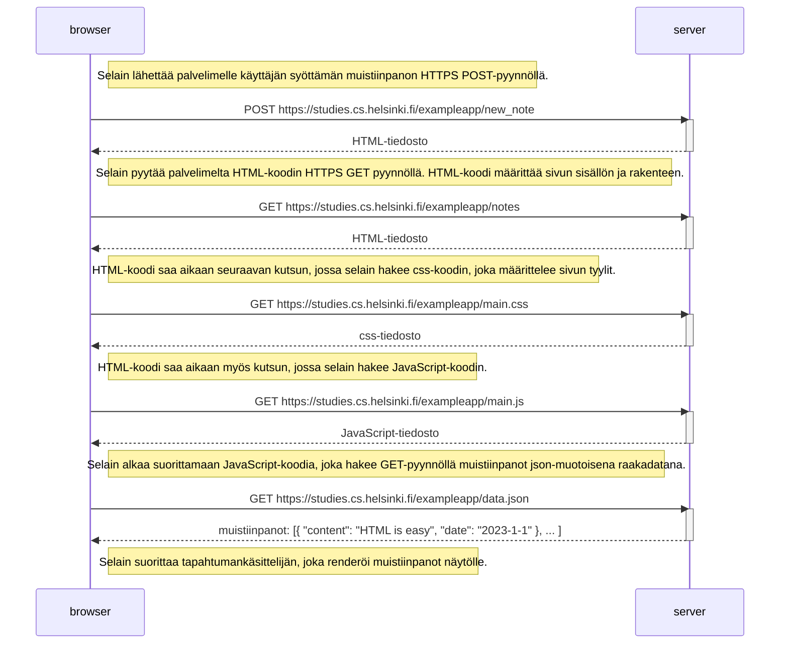
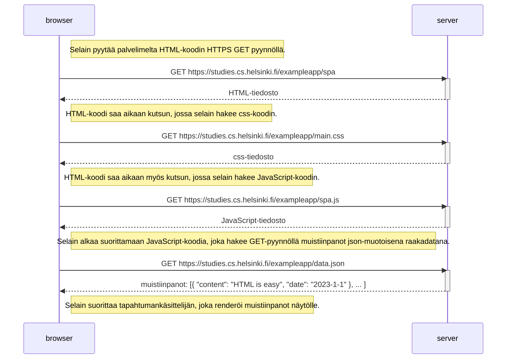
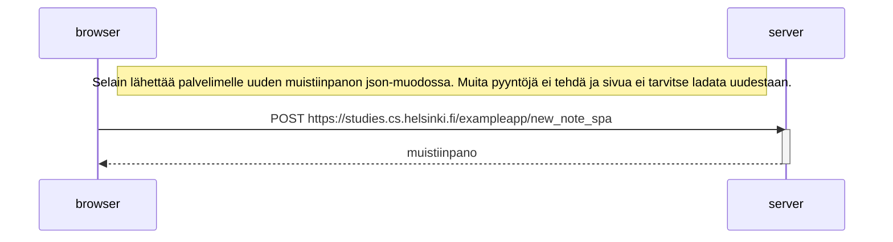

# Osa 0 Tehtävät

## Tehtävä 0.4

Tämä sekvenssikaavio kuvaa sellaisen tilanteen, jossa käyttäjä luo uuden muistiinpanon sivulla https://studies.cs.helsinki.fi/exampleapp/notes.

	
## Tehtävä 0.5

Tämä sekvenssikaavio kuvaa sellaisen tilanteen, jossa käyttäjä menee osoitteeseen https://studies.cs.helsinki.fi/exampleapp/spa, joka on muistiinpanojen Single Page App -versio.

## Tehtävä 0.6

Tämä sekvenssikaavio kuvaa sellaisen tilanteen, jossa käyttäjä luo uuden muistiinpanon Single Page App -versiossa.

